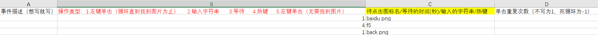

# 自动抢课脚本使用手册

@danteking dating from 2021.12.7 and last updating at 2021.12.8

---

借助[pyautogui库](https://pyautogui.readthedocs.io/)，我们可以轻松地控制鼠标、键盘以及进行图像识别，实现自动抢课的功能

## 1.准备工作

我们在仓库里提供了2个必须的文件，包括：

- **auto_get_lesson_pic_recognize.py**：脚本文件
-  **info.xlsx**：执行操作信息文件

在运行这个脚本（**auto_get_lesson_pic_recognize.py**）前，你需要：

1.安装python并成功配置环境变量，可以在cmd下这样检查；若返回版本号，则已安装

```bash
python --version
```


2.安装以下的依赖，windows用户请以管理员用户运行cmd并依次执行：

```bash
# pyautogui库
pip install pyautogui
# 读取excel表格的库
pip install xlrd==1.2.0
# 向计算机的剪贴板发送文本/从计算机剪贴板接收文本的库
pip install pyperclip
# 计算机视觉库
pip install opencv-python
# 图像处理库
pip install pillow 
```

到此，成功安装了5个库


## 2.配合使用py脚本和xlsx文件

### 第一步

需要将抢课的每一步所需要点击的**图标/超链接**在头脑中想清楚

### 第二步

将抢课每一步的所需点击的**图标/超链接**截图，保存在和py脚本同一路径下


打开excel表格，根据第一行提示在单元格中进行输入：



- A列------备注（可填可不填）

- B列------操作类型，目前包括：
  - 1.左键单击（循环直到找到图片为止）：意思就是如果没有找到你设置的那张图片，它就一直找下去，找不到就不停；你所设置的次数是**找到成功的次数**
  -  2.输入字符串     
  -  3.等待    
  -  4.热键
  -  5.左键单击（无需找到图片）：找图片不管找没找到，就找那这么多次，**次数=找到成功的次数+找到失败的次数**
- C列------B列的参数
  - 待点击图标名（**包括图片后缀名**，如.png）
  - 等待的时间(秒)
  - 输入的字符串
  - 热键
- D列------单击重复次数
  - 不填，默认为1
  - 若想无限单击，填-1

按照你的选课步骤从第2行开始顺序填写excel表格的执行步骤

此时，保存excel表格

### 第三步

我们打开需要进行操作的选课网页

我们在cmd下切换到脚本所在目录

```bash
# 切换到D盘
D:
# 切换到xx文件夹
cd xx
python auto_get_lesson_pic_recognize.py
```

根据提示执行即可

## 上图示例


## 3.auto_get_lesson_pic_recognize功能介绍

### (1).抢课一次

注意

- 截图时请随机应变，匹配到图像后，鼠标自动点击图像正中央，建议配合qq截图，ctrl+a/t+a，选取一个独一无二的标记在截图中并且将所要点击的点放在qq截图四个蓝点的中央

  

- 如果遇到同一画面中需要点击的图标存在多个一样的，没有特征参照物，可以在那一步设置等待若干秒，手动点击图标
- 若未成功识别图片，将循环执行识别操作；手动点击图标成功，excel表格中中的指令也会跳到下一条
- 考虑到网络延迟问题，建议合理利用等待功能

### (2).蹲点捡漏

- 在抢课一次的基础上套了一层死循环
- 巧妙利用f5、左键单击（循环直到找到图片为止）、左键单击（无需找到图片），可以24h挂机实现蹲点捡漏
- 请发挥你的聪明才智，正确截图


## 4.坐标版本(不建议使用)

坐标版本位于**coordinate_version**目录下

如果能够确切知道所点击的位置的坐标，可以选用坐标版本

配合qq截图，你能够轻松知道你的鼠标在1920×1080分辨率下在屏幕上的坐标（以像素为单位）

顺序排列单击位置的坐标，实现抢课

excel表格中根据提示填写坐标、操作


## 5.致谢及感想

感谢 @不高兴就喝水 up主让我知道了pyautogui 库的存在

严禁将此脚本用于恶意占课，这违背了开发者的初衷

本项目采用**MIT License**，二次开发请同样遵循该协议	